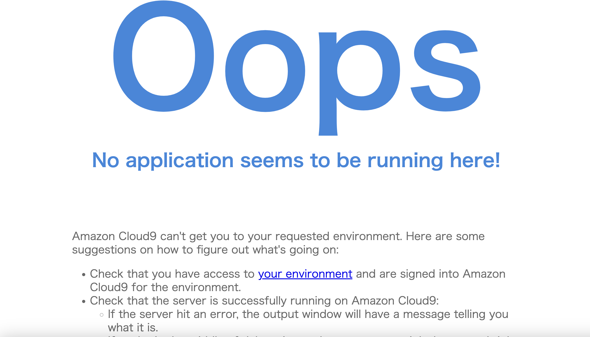
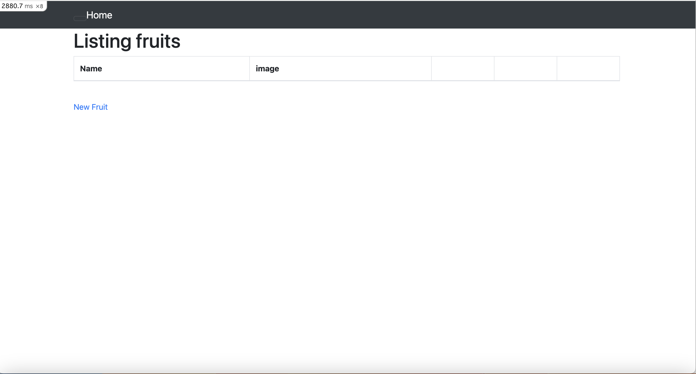
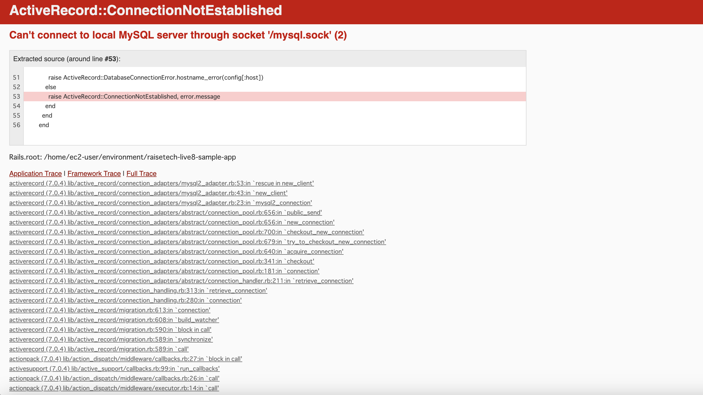

# 第3回課題
## APサーバーについて調べてみましょう
- 名前　puma  
- バージョン 5.6.5  
### APサーバーを終了させた場合、引き続きアクセス出来ますか？
- アクセス出来ない  

### APサーバーを再起動  
- アクセス出来る 
  

## DBサーバーについて調べてみましょう  
- 名前　MySQL  
- バージョン　8.0.33  
### DBサーバーを終了させた場合、引き続きアクセス出来ますか？  
- アクセス出来ない  

### Railsの構成管理ツールの名前は何でしたか？  
- 名前　Bundler  

## 今回の課題から学んだこと　　
- Webアプリケーションについて学んだ。  
- 最低でもインフラ技術に関係する知識は深くなくとも、広く知っていた方が今後の為になると思った。  
- 課題をクリアしたら終わりではなく、何度も何度も復習をして一つでも多く理解する様に頑張ります。